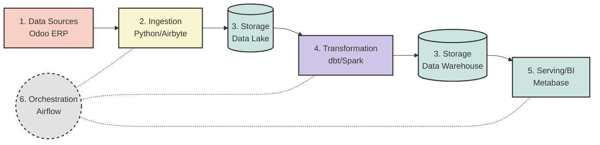

# End-to-End Data Engineering Platform 🚀

Dự án này là một hệ thống Data Engineering hoàn chỉnh (End-to-End), được thiết kế theo tư tưởng **Microservices** và **Technology-Agnostic** (Chia theo các Logical Nodes độc lập, dễ dàng thay thế công nghệ). 

Toàn bộ các dịch vụ trong hệ thống được đóng gói bằng Docker và kết nối với nhau thông qua một mạng lưới chung.

## 🎯 Business Domain (Lĩnh Vực Bài Toán)

Dự án này được thiết kế để giải quyết bài toán dữ liệu cho mô hình **Omnichannel D2C FMCG** - một trong những mô hình phức tạp và thực tế nhất hiện nay. Đây là sự kết hợp của 3 lĩnh vực lớn:

1. **FMCG (Hàng tiêu dùng nhanh):** Quản lý vòng đời sản phẩm, ngày sản xuất, hạn sử dụng (Expiration dates/Lots) để tránh rủi ro tồn kho cận date.
2. **E-commerce & Bán lẻ đa kênh (Omnichannel Retail):** Dữ liệu phân mảnh từ bán hàng online (D2C Website) đến offline (Cửa hàng vật lý - POS) và bán buôn (Wholesale). Mục tiêu là hợp nhất dữ liệu để phân tích Customer 360 và hiệu suất doanh thu theo từng kênh.
3. **Logistics & Supply Chain:** Theo dõi luồng dịch chuyển của hàng hóa từ kho trung tâm đến các điểm bán và người dùng cuối. Đo lường thời gian xử lý đơn hàng (Fulfillment Lead time) và cảnh báo đứt gãy tồn kho (Out-of-stock).

**Kịch bản dữ liệu (Data Scenario):** Hệ thống sử dụng **Odoo ERP** làm trái tim vận hành (Master Data & Transactional Data). Toàn bộ dữ liệu Bán hàng, Kho bãi, và Khách hàng từ Odoo sẽ được hệ thống Data Pipeline này tự động thu thập, làm sạch, và biến đổi thành các Data Models chuẩn mực (Star-schema) để phục vụ cho các Báo cáo chiến lược (BI Dashboards).

## 🏗 Kiến Trúc Hệ Thống (Architecture)

Dữ liệu đi qua hệ thống theo đường ống (pipeline) dưới đây:



## 📂 Cấu Trúc Thư Mục (Codebase)

Codebase được thiết kế với chuẩn mực cao: thư mục cấp 1 thể hiện **"bước"** trong quy trình (logical nodes), còn thư mục con thể hiện **"công nghệ"** được áp dụng cho bước đó:

* **`data_sources/`**: Nơi phát sinh dữ liệu (VD: `odoo` - Hệ thống ERP kinh doanh).
* **`ingestion/`**: Khâu thu thập dữ liệu (VD: `custom_python` script để gọi API hoặc kết nối `airbyte`).
* **`storage/`**: Hệ thống lưu trữ, bao gồm `data_lake_minio` (chứa dữ liệu thô - raw data) và `data_warehouse_pg` (chứa dữ liệu đã được làm sạch - structured data).
* **`transformation/`**: Tầng biến đổi dữ liệu (VD: `dbt` để transform, build các data models).
* **`orchestration/`**: Tầng điều phối và quản lý lịch trình chạy pipeline (VD: Apache `airflow`).
* **`serving/`**: Tầng giao tiếp với người dùng cuối, biểu đồ hóa dữ liệu (VD: `metabase`).
* **`shared/`**: Các tài nguyên dùng chung như `notebooks` (khám phá dữ liệu EDA) và dữ liệu tạm `data`.

## 🌐 Mạng Lưới Nội Bộ (Docker Network)

Đặc thù của hệ thống phân tán là các node phải "nhìn thấy" nhau (VD: Airflow phải truy cập được vào Database Odoo). Do đó, toàn bộ các services được cấu hình để chạy chung trên một mạng lưới ngoài có tên là: **`end2end_data_network`**.

Nếu mạng lưới này chưa tồn tại trên máy tính, bạn cần tạo nó trước khi chạy bất kỳ service nào:
```bash
docker network create end2end_data_network
```

*(Quy tắc: Khi viết cấu hình `docker-compose.yml` cho bất kỳ một tool nào mới ở các node khác, luôn ghi đè mạng `default` trỏ về `end2end_data_network`)*.

## 🚀 Hướng Dẫn Sử Dụng (Quickstart)

*(Đang cập nhật - Hiện tại dự án đã hoàn thành cấu hình cho module Orchestration)*

**Khởi động Airflow:**
1. Di chuyển vào thư mục Airflow:
   ```bash
   cd orchestration/airflow
   ```
2. Build và khởi động bằng Docker Compose:
   ```bash
   docker compose -f docker-compose.airflow.yaml up -d --build
   ```
3. Truy cập giao diện Airflow Web UI tại: `http://localhost:8081` 
   *(Tài khoản mặc định: `airflow` / Mật khẩu: `airflow`)*.
